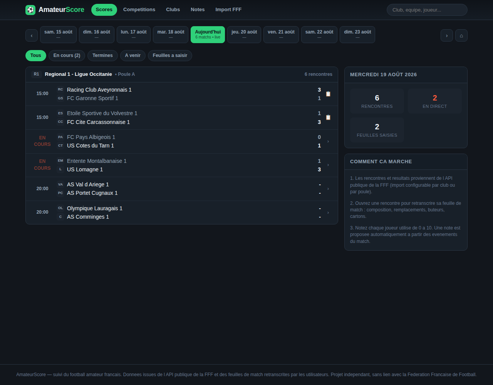
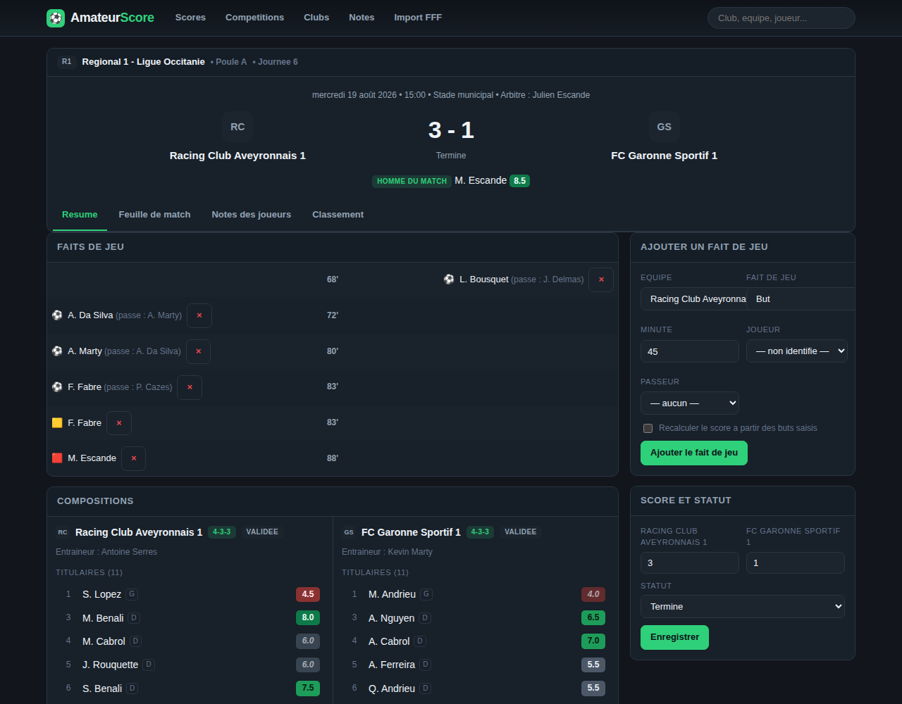
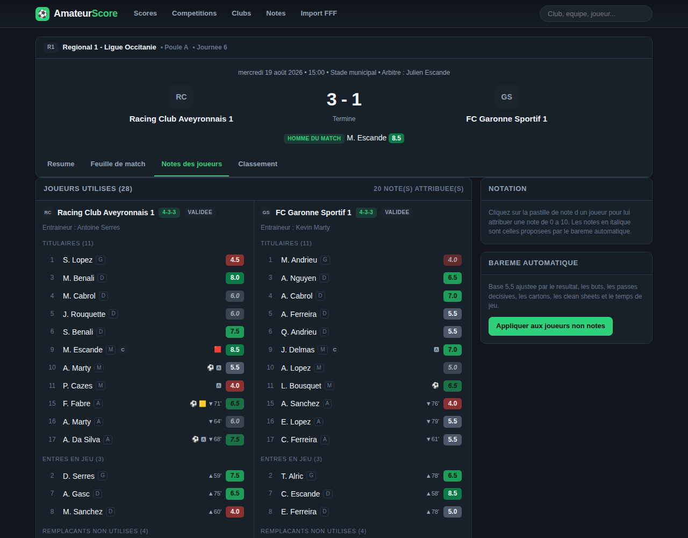
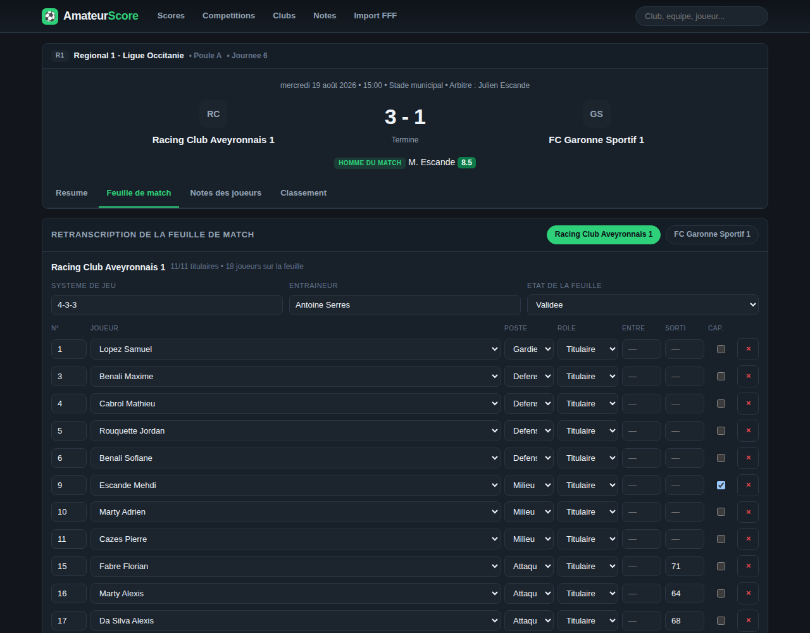

# AmateurScore

Application de suivi du **football amateur français** : résultats en direct façon Flashscore,
import des données publiques de la **FFF**, retranscription des **feuilles de match** et
**notation des joueurs utilisés**.



## Ce que fait l'application

| Besoin | Réponse |
| --- | --- |
| Récupérer un maximum de données FFF | Client de l'API publique `api-dofa.fff.fr` : clubs, équipes, compétitions, poules, calendriers, résultats. Import par club (`cl_no`) ou par poule (`cp_no/ph_no/po_no`), avec cache disque, limitation de débit et journal des imports. |
| Retranscrire des feuilles de match | Éditeur complet : composition (11 titulaires max), remplaçants entrés / non entrés, numéros, postes, capitaine, minutes d'entrée et de sortie, système de jeu, entraîneur, buts, passes décisives, cartons, penalties. |
| Lister les joueurs utilisés et les noter | Note de 0 à 10 par demi-points, note automatique proposée par un barème, moyenne pondérée par le temps de jeu, homme du match, tableau des joueurs utilisés (matchs, titularisations, minutes, buts, passes, cartons, forme). |
| S'inspirer de Flashscore | Barre de dates glissante, rencontres groupées par compétition, badge « en cours » clignotant, score en gras, fiche match à onglets (résumé / feuille de match / notes / classement), classements avec forme sur 5 matchs, recherche instantanée. |

### Aperçus

| Fiche match | Notes des joueurs | Retranscription |
| --- | --- | --- |
|  |  |  |

## Prérequis

**Node.js 24 LTS** (ou toute version ≥ 23.4) — [nodejs.org](https://nodejs.org). Aucune autre
installation : pas de base de données à part, et aucune dépendance native à compiler, donc ni
Python ni compilateur C++.

Sur Node 22.5 à 23.3, le module SQLite intégré existe mais reste derrière une option : lancez les
commandes avec `NODE_OPTIONS=--experimental-sqlite` (`set NODE_OPTIONS=--experimental-sqlite` sous
Windows). Le message d'erreur au démarrage le rappelle si besoin.

## Démarrage rapide

```bash
npm install
npm run seed          # jeu de données de démonstration (fictif, ancré sur la date du jour)
npm run dev           # API sur http://localhost:4000 + interface sur http://localhost:5173
```

En production :

```bash
npm run build         # compile le serveur puis l'interface
npm start             # un seul processus sert l'API et l'interface sur http://localhost:4000
```

`npm start` sans `npm run build` prealable ne sert que l'API : la page d'accueil explique alors
quoi lancer. Les chemins de la base et de l'interface sont resolus depuis le dossier `server/`,
le serveur peut donc etre lance depuis n'importe quel repertoire.

Copiez `.env.example` vers `.env` pour ajuster le port, le chemin de la base ou les paramètres FFF.

## Architecture

```
server/                 API Fastify + SQLite (module `node:sqlite` integre), TypeScript
  src/domain/           regles metier pures : bareme de notation, classements, types
  src/fff/              client API DOFA (cache, debit, pagination Hydra), mappers, fixtures
  src/db/               schema SQL, migrations, requetes
  src/services/         import FFF, feuilles de match, notes
  src/routes/           routes HTTP
  src/scripts/          seed et import en ligne de commande
  test/                 64 tests (vitest)
web/                    interface React + Vite (TypeScript, CSS maison, theme sombre)
docs/                   documentation API FFF et bareme de notation
```

Le stockage est un simple fichier SQLite (`server/data/amateurscore.db`), ouvert avec le module
`node:sqlite` fourni par Node : aucune base externe à installer, et aucun module natif à compiler
au moment de `npm install`. Le pilote est isolé dans
[`server/src/db/driver.ts`](server/src/db/driver.ts), qui ajoute la gestion des transactions
(imbriquées comprises). Les règles métier sont isolées dans `server/src/domain/`, sans dépendance à la base ni
au réseau, ce qui les rend testables directement.

## Données FFF

L'import interroge l'API publique utilisée par fff.fr. Les points d'entrée sont regroupés dans
[`server/src/fff/endpoints.ts`](server/src/fff/endpoints.ts) et documentés dans
[`docs/api-fff.md`](docs/api-fff.md).

```bash
npm run sync -- --clubs 553,12345      # importe un ou plusieurs clubs (cl_no)
npm run sync -- --pool 420001/1/3      # importe une poule complete
FFF_OFFLINE=1 npm run sync -- --clubs 553   # rejoue l'import sur les fixtures locales
```

L'écran **Import FFF** de l'interface propose les mêmes actions, l'historique des imports et un
bouton de test de connectivité.

Le client est volontairement prudent : une requête toutes les 600 ms par défaut, cache disque
d'une heure, trois tentatives avec repli exponentiel, et un mode hors-ligne sur fixtures.

> **Limite connue dans cet environnement de développement** : l'accès sortant vers
> `api-dofa.fff.fr` est bloqué par la politique réseau (réponse `403` du proxy). L'import réel n'a
> donc pas pu être exécuté ici ; il est validé de bout en bout par des tests rejouant les
> réponses de l'API (`FFF_OFFLINE=1` et clients simulés). Sur une machine disposant d'un accès
> sortant, `npm run sync` fonctionne sans modification. Comme l'API DOFA n'est pas contractualisée
> publiquement, les mappers acceptent plusieurs orthographes de champ et ignorent proprement ce
> qu'ils ne comprennent pas : si un chemin change, seul `endpoints.ts` est à corriger.

## Notation des joueurs

Deux notes coexistent pour chaque participation :

* la **note attribuée** (0 à 10, par demi-points), saisie dans l'onglet « Notes des joueurs » ;
* la **note proposée**, calculée automatiquement à partir des faits de jeu (affichée en italique
  tant qu'elle n'est pas validée).

Le barème part d'une base de 5,5 ajustée par le résultat collectif, les buts (pondérés par poste),
les passes décisives, les cartons, les penalties, les clean sheets et le temps de jeu — le détail
est dans [`docs/notation.md`](docs/notation.md). Les moyennes sont pondérées par les minutes
jouées, pour qu'une entrée de dix minutes ne pèse pas autant qu'un match complet.

## API REST

| Méthode | Route | Rôle |
| --- | --- | --- |
| `GET` | `/api/matches?date=&status=&team=&competition=` | rencontres groupées par compétition |
| `GET` | `/api/matches/calendar?date=` | nombre de rencontres par jour (barre de dates) |
| `GET` | `/api/matches/:id` | fiche complète : compositions, faits de jeu, notes, homme du match |
| `POST` `PATCH` | `/api/matches` `/api/matches/:id` | création manuelle, mise à jour du score et du statut |
| `PUT` | `/api/matches/:id/sheet/:side` | retranscription d'une feuille de match |
| `POST` `DELETE` | `/api/matches/:id/events[/:eventId]` | faits de jeu |
| `POST` | `/api/matches/:id/ratings/auto` | applique le barème aux joueurs non notés |
| `PUT` | `/api/appearances/:id/rating` | note et commentaire d'un joueur |
| `GET` | `/api/teams/:id` `/api/teams/:id/usage` `/api/teams/:id/squad` | équipe, joueurs utilisés, effectif |
| `GET` | `/api/players` `/api/players/:id` | fiche joueur, historique des notes |
| `GET` | `/api/standings?pool=` | classement calculé (3/1/0, différence de buts, forme) |
| `GET` | `/api/leaderboards` | meilleures moyennes, buteurs, temps de jeu |
| `GET` | `/api/clubs` `/api/competitions` `/api/search?q=` | référentiels et recherche |
| `POST` `GET` | `/api/sync/clubs` `/api/sync/pool` `/api/sync/status` `/api/sync/probe` | import FFF et diagnostic |

## Tests

```bash
npm test          # 64 tests : bareme, classements, mappers FFF, feuilles de match, routes HTTP
npm run typecheck
```

Les parcours d'interface (enregistrement d'une feuille, notation d'un joueur, ajout d'un but) ont
été vérifiés dans un navigateur réel avant livraison.

## Bon usage

* Les données FFF sont publiques mais le serveur de la fédération ne doit pas être sollicité
  inutilement : conservez une limitation de débit et un cache, et renseignez un contact valide dans
  `FFF_USER_AGENT`.
* Les feuilles de match concernent des joueurs amateurs, souvent mineurs : les notes et
  commentaires saisis sont des données personnelles. Restez factuel, limitez la diffusion et
  prévoyez une suppression sur demande avant toute mise en ligne publique.
* Projet indépendant, sans lien avec la Fédération Française de Football.

## Pistes d'évolution

* Import de la Feuille de Match Informatisée (FMI) quand elle est accessible pour une équipe.
* Notes collaboratives (plusieurs votants par joueur, moyenne des votants).
* Notifications de but pendant les rencontres en direct.
* Export CSV des joueurs utilisés et des notes sur une saison.
